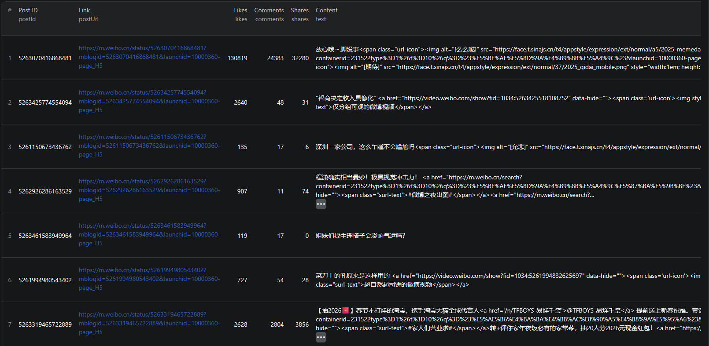

# How to Scrape Weibo in Node.js

This example shows how to scrape Weibo posts in Node.js using the [Weibo Scraper](https://apify.com/piotrv1001/weibo-scraper) actor on Apify. No browser automation or HTML parsing required — just call the actor via the Apify API client and get structured data back.



## What this example does

- Calls the Weibo Scraper actor with a configurable post limit
- Waits for the run to complete
- Fetches results from the actor's dataset
- Prints each post to the console

## Prerequisites

- [Node.js](https://nodejs.org/) v18 or higher
- An [Apify account](https://console.apify.com/sign-up) (free tier works)
- An [Apify API token](https://console.apify.com/account/integrations)

## Installation

```bash
npm install
```

## Environment setup

Copy `.env.example` to `.env` and add your Apify API token:

```bash
cp .env.example .env
```

Then edit `.env`:

```env
APIFY_TOKEN=your_apify_token_here
```

## Usage

```bash
npm start
```

## Code example

```js
import { ApifyClient } from 'apify-client';
import 'dotenv/config';

// Initialize the ApifyClient with your Apify API token
// Set APIFY_TOKEN in your .env file (copy .env.example to get started)
const client = new ApifyClient({
    token: process.env.APIFY_TOKEN,
});

// Prepare Actor input
const input = {
    "limit": 100
};

// Run the Actor and wait for it to finish
const run = await client.actor("piotrv1001/weibo-scraper").call(input);

// Fetch and print Actor results from the run's dataset (if any)
console.log('Results from dataset');
console.log(`💾 Check your data here: https://console.apify.com/storage/datasets/${run.defaultDatasetId}`);
const { items } = await client.dataset(run.defaultDatasetId).listItems();
items.forEach((item) => {
    console.dir(item);
});

// 📚 Want to learn more 📖? Go to → https://docs.apify.com/api/client/js/docs
```

## Example output

See [`sample-output.json`](./sample-output.json) for a full example. Each post object contains:

| Field | Description |
|---|---|
| `postId` | Unique Weibo post ID |
| `postUrl` | Direct link to the post on Weibo |
| `author` | Object with `id`, `name`, `profileUrl`, `verified`, `followersCount` |
| `createdAt` | Post creation timestamp |
| `text` | Post content (may include HTML for emoji spans) |
| `likes` | Number of likes |
| `comments` | Number of comments |
| `shares` | Number of reposts/shares |
| `images` | Array of image URLs attached to the post |
| `videos` | Array of video URLs attached to the post |
| `location` | Location tag if the user added one |

## Use cases

- **Social media monitoring** — track mentions, trends, and sentiment around brands or topics on Weibo
- **Influencer research** — analyze top accounts, follower counts, engagement rates, and posting patterns
- **Content research** — discover trending topics, hashtags, and viral posts in Chinese-language social media
- **Academic & market research** — collect large datasets of public posts for NLP, cultural, or consumer behavior studies
- **Competitive intelligence** — monitor how competitors or industry figures communicate with their Weibo audience

## Try the actor on Apify

**[Open the Weibo Scraper on Apify](https://apify.com/piotrv1001/weibo-scraper)**

## Related resources

- [How to Scrape Weibo Posts and Profiles](https://www.falconscrape.com/blog/how-to-scrape-weibo-posts-and-profiles) — in-depth blog post covering Weibo scraping techniques and use cases
- [How to Scrape Weibo Posts with Apify](https://www.youtube.com/watch?v=bCBLjb6hN9) — video tutorial on scraping Weibo posts using Apify

## License

MIT
